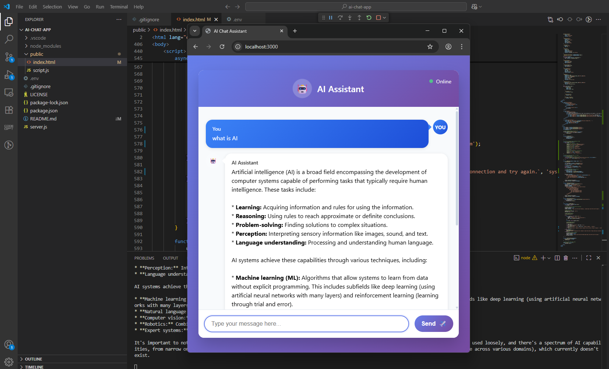

# 🤖 Simple AI Chat Bot

An experimental chatbot application built with Node.js and Express, using Google's Gemini AI model. This is a learning project to explore AI integration and basic web development.



*Screenshot of the AI Chat Bot interface*

## ✨ Features

- 💬 **Basic Chat Interface**: Simple web-based chat with an AI bot
- 🤖 **AI Integration**: Uses Google Gemini AI for responses  
- 📱 **Responsive Design**: Works on desktop and mobile
- 🔧 **Learning Project**: Great for understanding API integration
- 🔒 **Environment Variables**: Keeps API keys secure

## 🚀 Setup Instructions

### Step 1: Install Node.js and npm

**Windows:**
1. Go to [nodejs.org](https://nodejs.org/)
2. Download the "LTS" version (recommended)
3. Run the installer and follow the setup wizard
4. Restart your computer

**Mac:**
```bash
# Using Homebrew (recommended)
brew install node

# Or download from nodejs.org and install manually
```

**Linux (Ubuntu/Debian):**
```bash
sudo apt update
sudo apt install nodejs npm
```

**Verify installation:** Open terminal/command prompt and type:
```bash
node --version
npm --version
```
You should see version numbers if installed correctly.

### Step 2: Get the Code

**Option A - Download ZIP:**
1. Go to [https://github.com/Jeremy-06/ai-chat-app](https://github.com/Jeremy-06/ai-chat-app)
2. Click green "Code" button → "Download ZIP"
3. Extract the ZIP file to a folder (like `Desktop/ai-chat-app`)

**Option B - Use Git:**
```bash
git clone https://github.com/Jeremy-06/ai-chat-app.git
cd ai-chat-app
```

### Step 3: Open Terminal in Project Folder

**Windows:**
- Right-click inside the project folder
- Select "Open in Terminal" or "Open PowerShell window here"

**Mac/Linux:**
- Open Terminal
- Navigate to the project folder:
```bash
cd path/to/your/ai-chat-app
# Example: cd Desktop/ai-chat-app
```

### Step 4: Install Dependencies

In the terminal (inside your project folder), run:
```bash
npm install
```
This downloads all required packages. Wait for it to finish.

### Step 5: Get Google AI API Key

1. Visit [Google AI Studio](https://aistudio.google.com/app/apikey)
2. Sign in with your Google account
3. Click **"Create API Key"**
4. Copy the generated API key

### Step 6: Create Environment File

In your project folder, create a file named `.env` (exactly like that, with the dot):

**Windows:** Right-click → New → Text Document → rename to `.env`
**Mac/Linux:** Use any text editor or run `touch .env`

Add this inside the `.env` file:
```
GOOGLE_API_KEY=paste_your_api_key_here
PORT=3000
```
Replace `paste_your_api_key_here` with your actual API key.

### Step 7: Start the Application

In the terminal (same location), run:
```bash
npm start
```

You should see: "Server running on port 3000"

### Step 8: Open in Browser

Go to: **http://localhost:3000**

Your chatbot should be working!

## 🛑 Stop the Application

Press `Ctrl + C` in the terminal to stop the server.

## 📁 Project Structure

Your folder should look like this:
```
ai-chat-app/
├── server.js                  # Main Express server file
├── package.json               # Project dependencies and scripts
├── package-lock.json          # Exact dependency versions (auto-generated)
├── .env                       # Environment variables (contains your API key)
├── .gitignore                 # Files to ignore in Git
├── README.md                  # This documentation
├── LICENSE                    # License file (optional)
├── public/                    # Static files served by Express
│   ├── index.html            # Main chat interface
│   ├── style.css             # Styles (if separate from HTML)
│   └── script.js             # Client-side JavaScript (if separate)
└── .vscode/                  # VS Code settings (optional)
    └── launch.json           # Debug configuration for VS Code users
```

**Essential files you need:**
- `server.js` - Your main server code
- `package.json` - Lists your dependencies (express, dotenv, etc.)
- `.env` - Your Google API key goes here (don't share this file)
- `public/index.html` - The chat interface users see

**Auto-generated files:**
- `package-lock.json` - Created when you run `npm install`
- `node_modules/` - Dependencies folder (ignored by Git)

**Optional files:**
- `.vscode/launch.json` - Helps VS Code users run/debug the app
- Separate CSS/JS files - You can put styles and scripts in separate files or keep them in `index.html`

## 🐛 Common Issues

**"npm is not recognized"**
- Node.js not installed properly. Reinstall from nodejs.org

**"Cannot find module"**
- Run `npm install` in the project folder first

**"Google API key missing"**
- Check your `.env` file exists and has the correct API key
- Restart the server with `npm start`

**"Port 3000 already in use"**
- Change PORT to 3001 in your `.env` file

**"Cannot GET /"**
- Make sure `index.html` is in the `public/` folder

## 🎨 What You Can Learn

- How to integrate with AI APIs
- Basic Express.js server setup
- Frontend-backend communication  
- Environment variable usage
- Simple web interface design

## 📄 License

This project is open source and available under the [MIT License](LICENSE).

---

⭐ **A simple chatbot experiment by [Jeremy-06](https://github.com/Jeremy-06)**